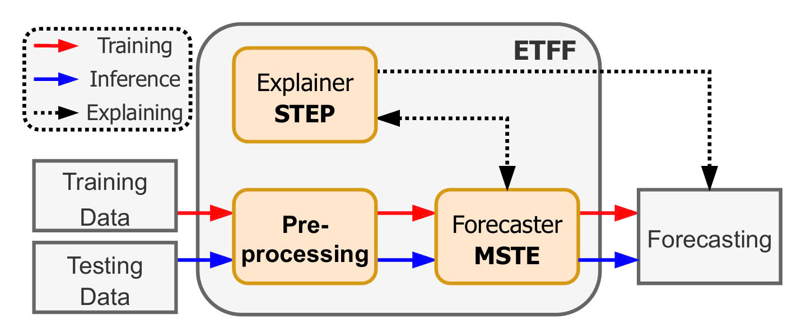

# XTF: eXplainable Traffic Forecasting Framework using Multiple Spatio-Temporal ODE Experts

### Abstract
Advances in technology have facilitated the trans formation of transportation systems through the deployment of sensor-equipped devices, generating extensive traffic data. Although recent traffic forecasting models, notably neural network based models, exhibit promising performance, they generally struggle to capture continuous spatio-temporal dynamics, are prone to overfitting, and lack transparency in their forecasting. To address these limitations of current methods, we introduce the eXplainable Traffic Forecasting framework (XTF). XTF employs hierarchical ordinary differential equations (ODEs) to continuously model spatio-temporal dynamics, facilitating more accurate representations of complex traffic patterns. To mitigate overfitting, XTF utilizes an ensemble approach that integrates bagging and stacking strategies, thereby improving generalization across diverse datasets. Finally, XTF includes an explanation plug-in that generates saliency maps, enhancing the transparency and interpretability of forecasting results. Empirical studies using four real-world datasets provide evidence that XTF is capable of substantial improvements over state-of-the-art methods in terms of both forecasting accuracy and interpretability.

###  Framework Overview


### Requirements
This version runs on Python 3.11. To install requirements, run:
```bash
pip install -r requirements.txt
```

### Data Preparation
Download data from this repository [github](https://github.com/Jimmy-7664/STD-MAE) (The data file should be renamed to `data.h5` or `data.npz`). The data folder `store` should be organized as follow:
```bash
/store
|
|----/[Dataset Name]
|    |
|    |----adj_mx.pkl
|----/raw
     |
     |----/[Dataset Name]
          |
          |----data.[h5 or npz]
```
Then run this script to preprocess data:
```bash
python generate_data.py --dataset METR-LA
```

### Run MSTE

Pretrained checkpoints are included in `/checkpoints/[Dataset Name]` folder, as well as screenshots of running `test.py` on each checkpoint in `figures/result_[Dataset Name].jpg`.

#### Training
To run training on any dataset, run the `train.py`. You can reference the `checkpoints/run.sh` file for detailed configurations on each dataset:
```bash
# training METR-LA
python train.py --dataset METR-LA --batch_size 64 --epochs 100 \
                --clip 5 --n_experts 3 --n_stacks 2 \
                --time_0 0.9 --step_0 0.9 \
                --time_1 0.9 --step_1 0.3 \
                --time_2 0.9 --step_2 0.3 \
                --end_dim 128 --decoder_types 1,2
```
#### Testing
To test on any dataset, make sure you have the checkpoint file (`.pth` file) in the right location:
```bash
/saved_models
|
|----/[Dataset Name]
     |
     |----/mste
          |
          |----G_T_model_[epoch].pth
```
To run testing on any dataset, run the `test.py` script. You can reference the `checkpoints/run.sh` file for running test on the checkpoints provided in the `/checkpoints` folder:
```bash
# testing METR-LA (make sure /saved_models/METR-LA/mste/G_T_model_99.pth exists)
python test.py --dataset METR-LA --start 99 \
               --n_experts 3 --n_stacks 2 \
               --time_0 0.9 --step_0 0.9 \
               --time_1 0.9 --step_1 0.3 \
               --time_2 0.9 --step_2 0.3 \
               --end_dim 128 --decoder_type 1,2
```

### Run STEP
To run on any dataset, make sure you have the checkpoint file (`.pth` file) in the right location:
```bash
/save_blackbox
|
|----/[Dataset Name]
          |
          |----G_T_model_[epoch].pth
```
You can refer to the `.pth` files from the available checkpoints in the` /checkpoints` folder and the hyperparameters provided in `STEP/runXAI.sh`. Then, run the following command for the METR-LA dataset:
```bash
cd STEP
python main_XAI.py --blackbox_file "../save_blackbox/METR-LA/G_T_model_99.pth" \
                   --n_experts 3 --n_stacks 2 \
                   --time_0 0.9 --step_0 0.9 \
                   --time_1 0.9 --step_1 0.3 \
                   --time_2 0.9 --step_2 0.3 \
                   --end_dim 128 --decoder_types 1,2
```
